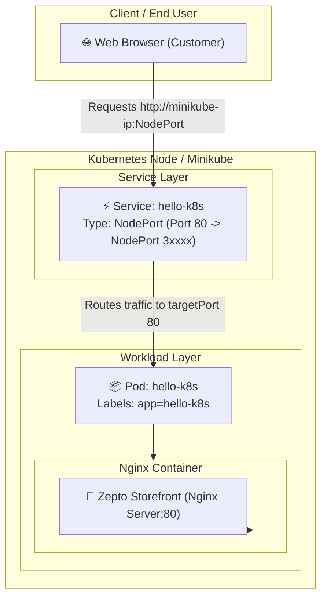

# Kubernetes Hands-On Exercise Series

Welcome to Exercise-1 **Kubernetes (K8s) exercises**!  
These activities will help you understand the basics of how Kubernetes runs and manages containerized applications.  

---

## 🏢 Business Problem (Zepto Example)

Imagine you are a **DevOps Engineer at Zepto**.  
The product team just built a lightweight **web app** that shows the **storefront and delivery status page** for customers.  

### Your Mission:
**Deploy this app on Kubernetes** so that it is always running, portable, and can be easily scaled later.  
We simulate this using the popular `nginx` container image (as Zepto’s storefront web app) and provide both:
1. **Imperative Approach** (using `kubectl run` and `kubectl expose` CLI commands)
2. **Declarative Approach** (using standard YAML manifests in [`manifests/`](./manifests/))

---

## 🎯 Exercise 1: Hello Pod

**Goal:** Run your first containerized application inside Kubernetes and expose it for external browser access.

---

## 📋 Pre-Requisites

Before starting, ensure you have a local Kubernetes cluster tool installed.

### 1. Install Minikube (One-Time Setup)

- **Windows (PowerShell run as Administrator):**
  ```powershell
  choco install minikube
  # Or with winget:
  winget install Kubernetes.minikube
  ```

- **Linux:**
  ```bash
  curl -LO https://storage.googleapis.com/minikube/releases/latest/minikube-linux-amd64
  sudo install minikube-linux-amd64 /usr/local/bin/minikube
  ```

- **macOS (with Homebrew):**
  ```bash
  brew install minikube
  ```

- **WSL (Windows Subsystem for Linux):**
  ```bash
  # Update system
  sudo apt-get update -y
  sudo apt-get install -y curl apt-transport-https

  # Download and install Minikube
  curl -LO https://storage.googleapis.com/minikube/releases/latest/minikube-linux-amd64
  sudo install minikube-linux-amd64 /usr/local/bin/minikube
  ```

> 💡 **Note:** Ensure **Docker Desktop** or a hypervisor driver is installed and running.

---

## 🚀 Execution Guide

You can complete this exercise using either the **Imperative (CLI)** method or the **Declarative (YAML)** method.

### Option A: Imperative Approach (CLI Commands)

1. **Start Minikube Cluster:**
   ```bash
   minikube start
   ```

2. **Create the Pod (Zepto Storefront simulation using Nginx):**
   ```bash
   kubectl run hello-k8s --image=nginx --port=80
   ```

3. **Verify the Pod Status:**
   ```bash
   kubectl get pods
   # Or with detailed view:
   kubectl describe pod hello-k8s
   ```

4. **Expose the Pod as a NodePort Service:**
   ```bash
   kubectl expose pod hello-k8s --type=NodePort --port=80
   ```

5. **Verify the Service:**
   ```bash
   kubectl get services
   ```

6. **Access the Application in Browser:**
   ```bash
   minikube service hello-k8s
   ```

---

### Option B: Declarative Approach (YAML Manifests)

Using declarative YAML files is the industry best practice for Infrastructure as Code (IaC) and GitOps.

1. **Deploy Pod and Service from Manifests:**
   ```bash
   kubectl apply -f manifests/pod.yaml
   kubectl apply -f manifests/service.yaml
   ```

2. **Check Running Resources:**
   ```bash
   kubectl get pods -l app=zepto-storefront
   kubectl get svc hello-k8s-service
   ```

3. **Open the Service:**
   ```bash
   minikube service hello-k8s-service
   ```

---

### Option C: Custom Zepto Storefront (With Delivery Tracker UI)

To deploy with the custom interactive Zepto 10-Minute Grocery Delivery Storefront UI:

```bash
# Apply ConfigMap containing Zepto HTML
kubectl apply -f manifests/zepto-storefront-configmap.yaml

# Apply Zepto Pod with mounted HTML
kubectl apply -f manifests/zepto-storefront-pod.yaml

# Expose Zepto Storefront
kubectl expose pod zepto-storefront --type=NodePort --port=80 --name=zepto-service

# Open in browser
minikube service zepto-service
```

---

## ⚙️ Quick Automation Scripts

Helper scripts are available in the [`scripts/`](./scripts/) directory:

- **Linux / macOS / WSL:**
  ```bash
  chmod +x scripts/deploy.sh scripts/cleanup.sh
  ./scripts/deploy.sh     # Deploy
  ./scripts/cleanup.sh    # Cleanup
  ```

- **Windows PowerShell:**
  ```powershell
  .\scripts\deploy.ps1    # Deploy
  .\scripts\cleanup.ps1   # Cleanup
  ```

---

## 🔍 System Internals & Architecture



### Key Concepts:
1. **Pod**: The smallest deployable unit in Kubernetes representing one or more containers sharing network and storage namespaces.
2. **Container**: The runtime environment executing the Nginx web server.
3. **NodePort Service**: A Kubernetes resource that routes external traffic arriving at a high port (30000-32767) on the node to container port 80.

---

## 🧹 Cleanup

When finished with the lab, clean up the created resources:

```bash
kubectl delete service hello-k8s hello-k8s-service zepto-service --ignore-not-found
kubectl delete pod hello-k8s zepto-storefront --ignore-not-found
kubectl delete configmap zepto-storefront-html --ignore-not-found
```

To stop Minikube:
```bash
minikube stop
```
